## Using gRPC With Xamarin
In this article I will show you how to use gRPC with Xamarin Forms. In short why using gRPC?  
From gRPC site:  
"gRPC is a modern open source high performance RPC framework that can run in any environment. It can efficiently connect services in and across data centers with pluggable support for load balancing, tracing, health checking and authentication. It is also applicable in last mile of distributed computing to connect devices, mobile applications and browsers to backend services."  

The standard Grpc.AspNetCore and Grpc.Net.Client under Xamarin cant call gRPC HTTP/2 so we will instead use the Grpc.AspNetCore.Web and Grpc.Net.Client.Web NuGets. They solve this problem and also make it possible to run as App Service in Azure. In this sample we will run both the server and the client locally when we test.

[Source code of Demo](https://github.com/JoacimWall/Blog_Samples/tree/main/gRPC_Xamarin)

### Lets get started with the server
Screenshots in this article is from Visual Studio For Mac but the process is the same for the Windows version of Visual Studio. 
Create a gRPC project by select the template "gRPC Service" in new solution in Visual Studio and click "Next".

I will name this service "Grpc.Server" and press create in the next dialog.

After this we need to update the Grpc.AspNetCore NuGet to latest in my case 2.34.0  
We also need to install the Grpc.AspNetCore.Web NuGet to latest in my case 2.34.0.

Now we test to build the server:  
if you get a error like this  
Error: "/Users/joacimwall/.nuget/packages/grpc.tools/2.27.0/tools/linux_x64/protoc" exited with code 255. (Grpc.Server)  
Just close the solution and open it agin and build as you can see in the error it's try to use "grpc.tools/2.27.0" but we are on version 2.34.0

#### In short what do we need to know
gRPC use a Proto file to define the messages you can see the sample file in the Proto folder and it looks like this.  
In this case we have a Greeter service and a request that are the message we will get from the client and a response that we will send to the client.
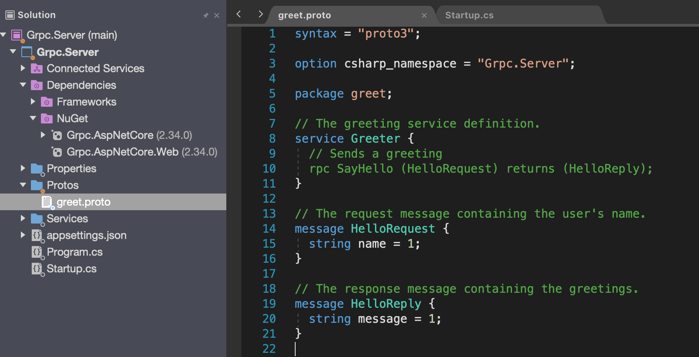

In the Services folder you will find the GreeterService.cs this is the class that implement the functions that you has declared in the proto file in this case the HelloReply. If you create a new message in the proto file you need to build before you can override that Message in this class.     
 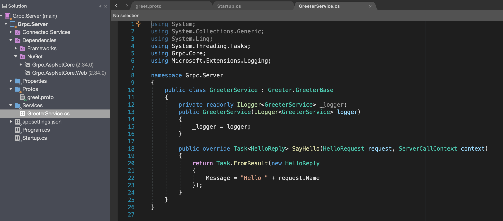

#### Configure AspNetCore to use Grpc.AspNetCore.Web 
We have one more file that are god to take a look at and that is the Startup.cs. It looks like this from the start. We need to change some lines to be able to get i to work with Xamarin.     
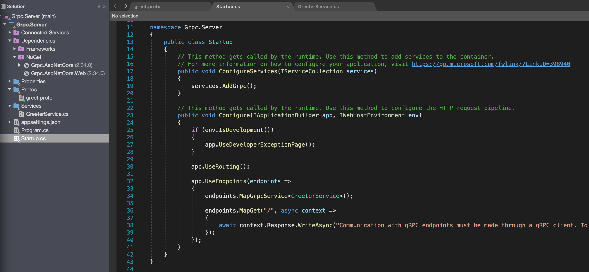
In the Configure function
add   
app.UseGrpcWeb();  
change the row:  
endpoints.MapGrpcService<GreeterService>();
to   
endpoints.MapGrpcService<GreeterService>().EnableGrpcWeb();

If you now try to start server and are on a mac or windows 7 you will get this error:   
Kestrel doesn't support HTTP/2 with TLS on macOS and older Windows versions such as Windows 7.
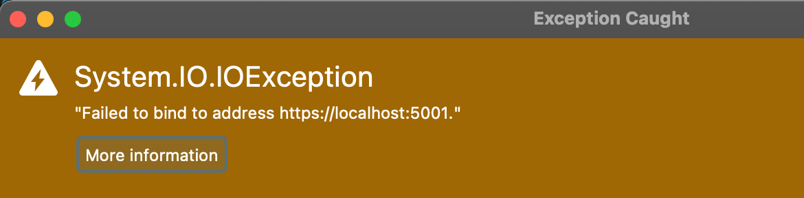
To debug local on this machine we need use Kestrel without TLS.
Open the file appsettings.json and copy the "Kestral" node.  
then open the file appsettings.Development.json and paste the "Kestral"  and change the value in "Protocols" to "Http1"
Now the files should look like this. 
 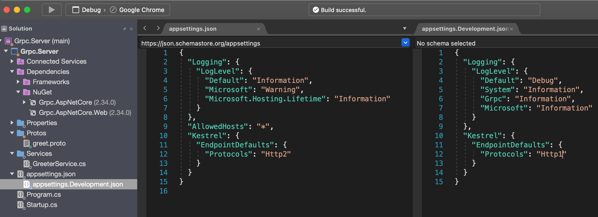

Test to start debugging you should now see this in your Application Output window:  
Microsoft.Hosting.Lifetime: Information: Now listening on: https://localhost:5001 

### Time to create the Xamarin forms Project  
Create a Xamarin project by select the template "Blank Forms App" press "Next"
I name this app GrpcDemo and press "Create" in the dialog.
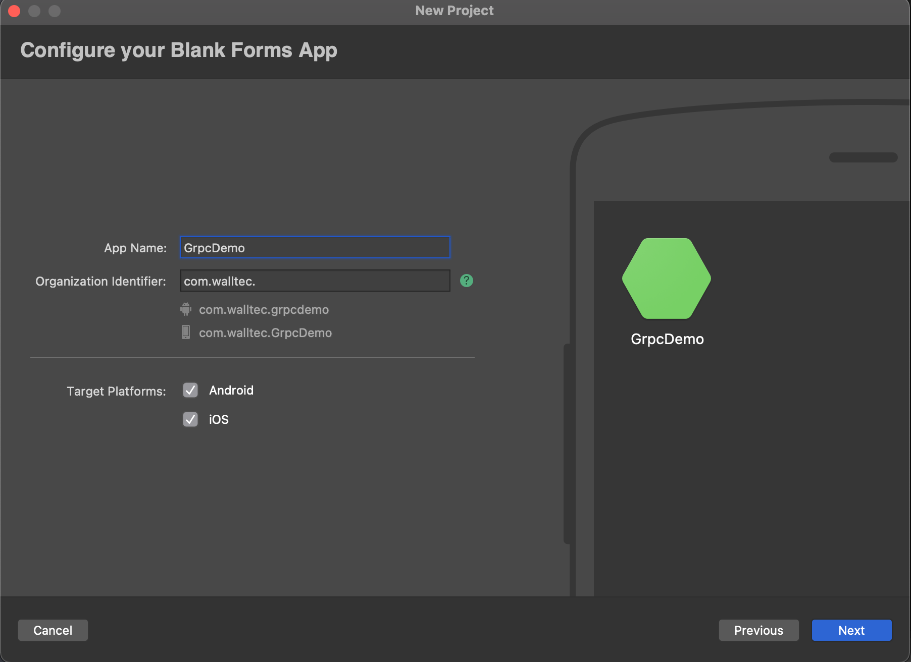

Change the Target framework to .NET Standard 2.1 in the Shared project by right click the project select Options select Build/General  and press "Ok"  
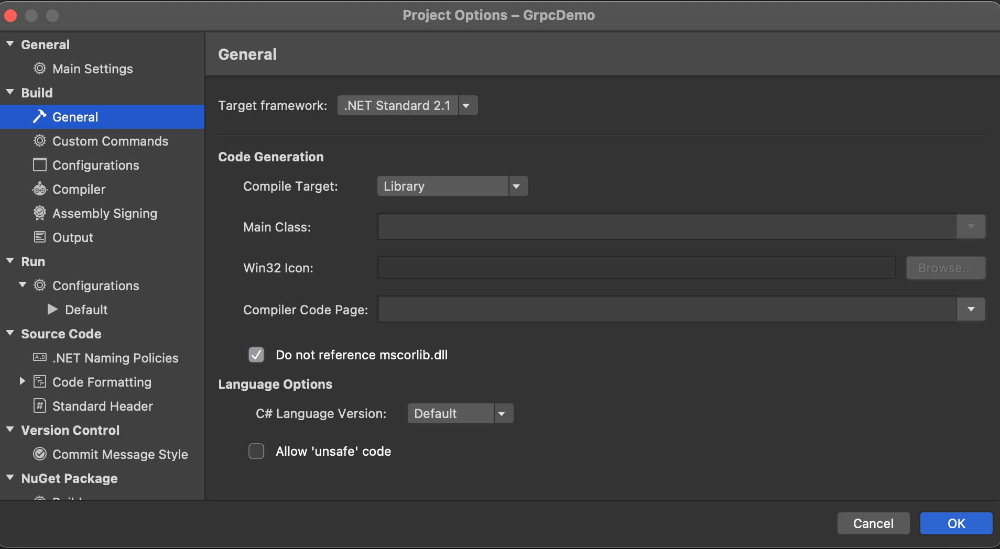
We also need to install the following NuGet in the shared project.  
Google.Protobuf Version="3.14.0"  
Grpc.Net.Client Version="2.34.0"  
Grpc.Tools Version="2.34.0"  
Grpc.Net.Client.Web Version="2.34.0"  
Refractored.MvvmHelpers

Create a new folder named Proto in the shared project and copy the file greet.proto from the server project to the newly created Proto folder.  
Create a new folder named Service in the shared project and add a new class named GreeterService.cs  
Now should your solution look like this:
 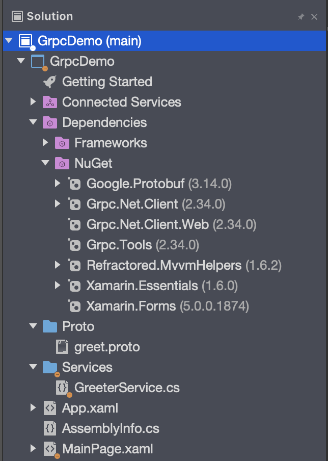
For the gRPC to build the classes that we are going to override in the GreeterService class we need to modify the project file for the shared project. Right click the project and select "Edit Project file". 
 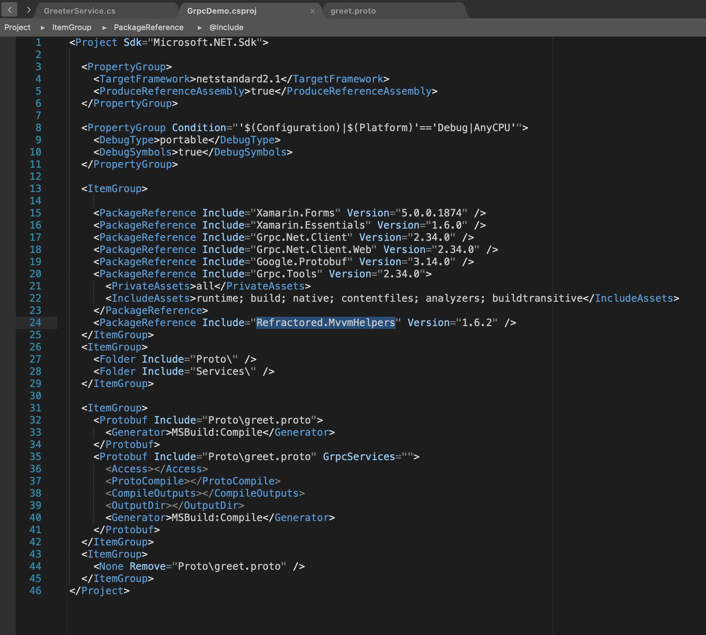
If you don't want to write all the lines you can copy from demo repository 

[Source code of Demo](https://github.com/JoacimWall/Blog_Samples/tree/main/gRPC_Xamarin)  
Build the shared project and copy the content from the GreeterService.cs file in the demo repository to you GreeterService.cs file. Now it would look like this. We will explain the code below. 
In the constructor we will create the client an connect to the server.   
Then the "if Debug" statement is needed to be able to debug to the local server where we have no trusted certificate. If we was using a Azure App Service we would not need this.  

The row with the Device.Android is if we use local Android Emulator for debugging  

 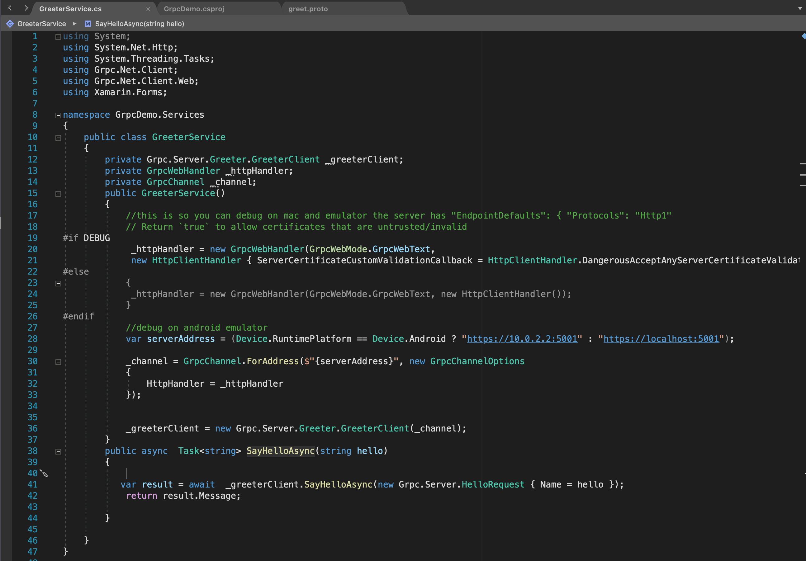 

 Now open your App.xaml.cs and add a public object of type  
 public static Services.GreeterService GreeterService;

 And in your OnStart and OnResume Add this line  
 GreeterService = new Services.GreeterService(); 

Add a ViewModel to MainPage.xaml by creating a new class named MainPageViewModel.cs containing this. 
 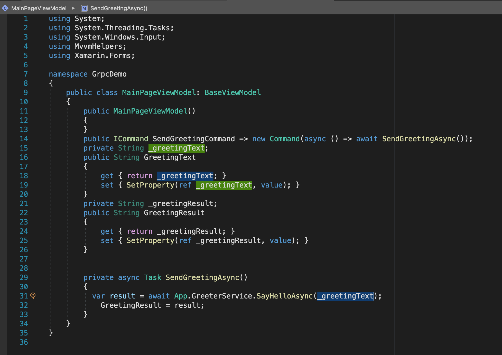   
And update the MainPage.xaml to this  
 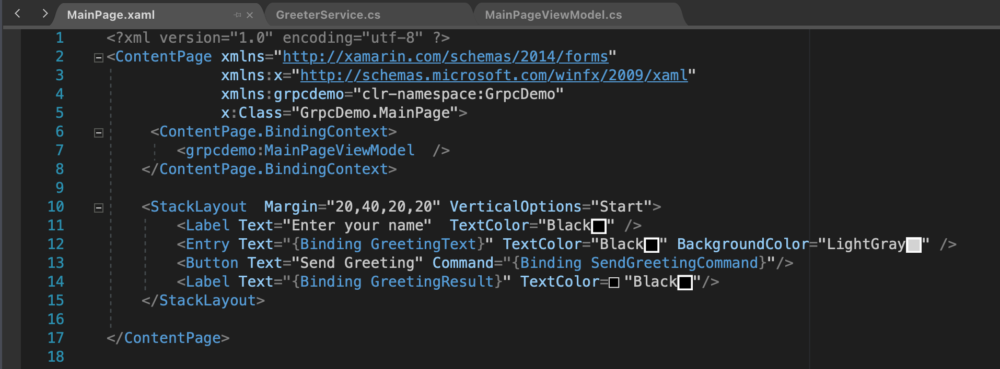 

 Now we are done and you can start the server and the client and test to send messages.   

### Conclusion   
This is just a simple sample of how you can use gRPC in Xamarin i have left out all error handling regarding GRPC errors and message size and more. 
You should not create the channel to often because it is time consuming.  
Regarding hosting this in Azure under App Service it's possible i have done it. When you publish to Azure you will se a message that Azure not support gRPC but that is for the native .net not the .web version.

Thanks Joacim Wall  

If you have questions or comment please add them as Issues on my 
[Blog_Samples Repository](https://github.com/JoacimWall/Blog_Samples/issues)  

[Source code of Demo](https://github.com/JoacimWall/Blog_Samples/tree/main/gRPC_Xamarin)
 

