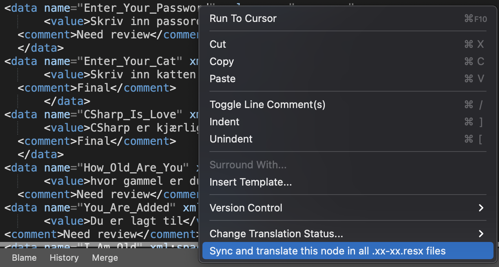

## Simplify translation management by using the Multilingual Extension
In this previous article [Add multilingual support to Xamarin](https://joacimwall.github.io/#multilingual_support/) I show you how to add multilingual support to a Xamarin forms project. In this article I will show you how to use the [Multilingual Extension](https://github.com/JoacimWall/Visual-studio-multilingual-extension) for simplify the synchronization from the master file to different language files. 

[Source code of Demo](https://github.com/JoacimWall/Blog_Samples/tree/main/Add%20multilingual%20support%20to%20Xamarin)

We are going to use this extension to simplify ans solve four main problem.  
 * Synchronization of Resx files  
 * Translation of texts by Google translate or Microsoft translate  
 * Export of translations into csv or xlsx file for final translation by external stakeholder  
 * Import of final translations from external stakholder  

We will continue whit the same project as we started with in the previous article [Add multilingual support to Xamarin](https://joacimwall.github.io/#multilingual_support/)

[Source code of Demo](https://github.com/JoacimWall/Blog_Samples/tree/main/Add%20multilingual%20support%20to%20Xamarin)

### Install the extension
First we need to install the extension. below you will find the instructions for the different platforms. Remember to restart you visual studio after install for the extension to load.  

#### Install for Mac
The Visual studio for Mac team has closed the signup for new developers to publish extensions. So you need to download the latest release from this page then go to visual studio mac and click "install from file" in the Exstension Mananger.  
[Latest release](https://github.com/JoacimWall/Visual-studio-multilingual-extension/releases)

#### Install for Windows 
Go to Extension Manager and search for Multilingual Extension or Walltec and you will find it or use the link below.   
[Multilingual extension](https://marketplace.visualstudio.com/items?itemName=Walltec.MultilingualExtension)

### Setting the preferred property's for the extension. 
Select tools/multilingual settings in visual studio   
By default, this extension use Google's free translation lets keep that for now.    
This is limited to only 100 translations per hour.   
In this dialog you can also change the master language that is 'en' by default.  
Here should you also select your preferred export format, csv or xslt.  
If you also want to handle the status for the texts in the master resx file, check the 'Add Comment node to master Resx file on sync' in settings dialog.

### Adding a new translation and synchronize
 There are two ways to sync the resx files. 
 Right-click the master file and select "Sync all .xx-x.resx files with this". Then all files that are in the same folder and follow the naming standard .xx-xx.resx  will be synchronized with the master file or,  
Right-click one of the language files (AppResources.fr-FR.resx) and select "Sync this .xx-x.resx file". This file will then be synchronized with the master file. 

the synchronization will not only add translations to the language files it will also remove translation that are not present in the master file.

So lets add a new translation "HTML is funny" into the master file this is easy done by just copy/past the last datanode from master file and change the name attribute and the value in the value filed.   
Now Right-click the master file and select "Sync all .xx-x.resx files with this".  
  
  

Open the AppResources.fr-FR.resx and AppResources.es-ES.resx and scroll down and you will see that the sentence has bin added to these files. You will also see that the text is not translated yet and there is comment that has the value "New" on the node named HTML_Is_Funny and the node C_Sharp_Is_Love comment has value Final. The extension use the comment filed to track the status of the translation. The translation can have three different status that it can have in it's comment field.   

New: The row will get this status after first synchronization. If the data row not exist in the target file. if the translation already exists then it gets the status "final" this is so you can start using this extension if you already have translation files that are translated.

Need review: This status will it get after translation from one of the translation services.

Final: This status will it get after import from csv/xslt file where the status column bin changed to final. You can also set this status in the target file if you don't want the row to be exported to external stakeholder for translation.

### Translate your resource files
Now we would like to translate to different sentences you have added to your language files.  There are two ways to translate the resx files.
Right-click the master file and select "Translate all .xx-x.resx files" Then all the language files will be Translated or Right-click one of the language files (AppResources.fr-FR.resx) and select "Translate this .xx-x.resx file".

The extension will only translate values that has comment value set to "New". 
After this your language files comment filed should changed from "New" to "Need review".   

### Export your language files to external stakeholders
If you now want to send the files to someone that not a developer you can export to Excel or Csv so they can validate the translations and change the comment value to "Final" so you can import the new/validated translation.  

This is done by Right-click the master file and select "Export all .xx-xx.resx files". Then all files that are in the same folder and follow the naming standard .xx-xx.resx will be processed and all rows with status 'New' or 'Need review' will be exported. 

This will result in new Excel files in same folder as the resx files.  The stakeholder can now change the status to "Final" if all is correct or change the TargetLanguage and status to "Final" and tha translation will be update when you import the file.  

### Import translations   
 When you get your translations files back from your stakeholders you just copy them to the same folder as the resx files and check that the users not have change de name of the files. Then you Right-click the Excel file and select  "Import Translation" and the file will get imported and the corresponding resx file will be updated.  

### Changing existing translations
 If you change the text in an existing node or add a new node in the Master resx file and want to sync and translate this to all the language files. Right click somewhere on the data name = 'xxxxx' node and select "Sync and translate this node in all .xx-xx.resx files". This will translate this node in all language files and change status to "Need review". This feature is only implemented on mac in current version of the extension.             

Thanks Joacim Wall  

[Source code of Demo](https://github.com/JoacimWall/Blog_Samples/tree/main/Add%20multilingual%20support%20to%20Xamarin)

