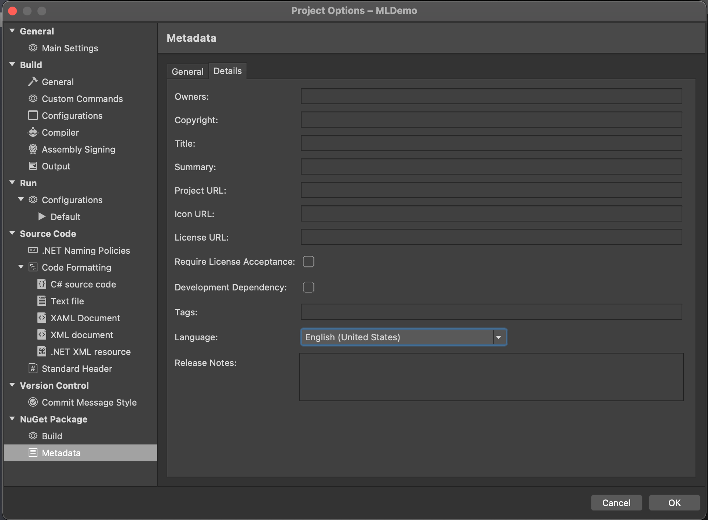
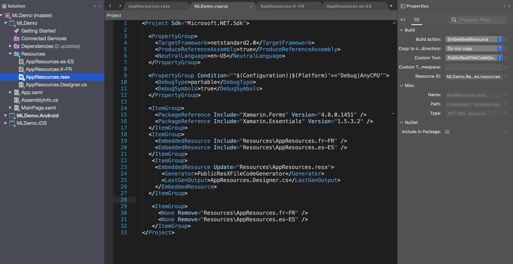

## Add multilingual support to Xamarin project
In this article I will show you how to add multilingual support to a Xamarin forms project. We will use standard Resources files to handle the different languages and the [Multilingual Extension](https://github.com/JoacimWall/Visual-studio-multilingual-extension) for simplify the synchronization from the master file to different language files. This extension is not needed but then you will need to handle all the translation manual.

### Les get started
Screenshots in this article is from Visual Studio For Mac but the process is the same for the Windows version of Visual Studio.  Create a Xamarin project by select the template "Blank Forms App"
I will name this app MLDemo and press Next and then create in the next dialog.

Now lets create a new folder named Resources then right click and add a new Resources file to that folder named AppResources and press new.

Now you should have project structure and a AppResources.resx file looking like this. This resx file is you master language file and it's from this file we will synchronize the translations to the other languages files files. If you created the resx file on Windows computer you will also se the xsd part of the file this is the rolls for the resx file like that you are not allowed to att to data filed with the same name. On mac you will not get this validations. 
    

Set the natural language of you app by right click the shared project and select options. then under MetaData/details select English or other preferred language that reflect you master file. In this demo I select English (United States).   

To support two more language lets add two more resx files. In this sample we are going to support French and Spanish. When we add this files we will use a naming convention that include both the country code and language this is needed if you should support both French in France(Resources.fr-FR.resx) and French in Canada (Resources.fr-CA.resx).  

Now we are going to add two files to the folder Resources
AppResources.fr-FR.resx for French
AppResources.es-ES.resx for Spanish

Important is that we keep the same name as the master resx file in this case AppResources.resx.

For a list of culture codes see [language codes](https://github.com/JoacimWall/Visual-studio-multilingual-extension).

For the intellisense to work the master file needs a AppResources.Designer.cs file. Under property's change Custom Tool to PublicResxFileCodeGenerator. I like to remove the Designer.cs file for the other language files to keep it cleaner as you se in the MLDemo.csproj file.  

Now lets add some translations to the master file and the other language files.
