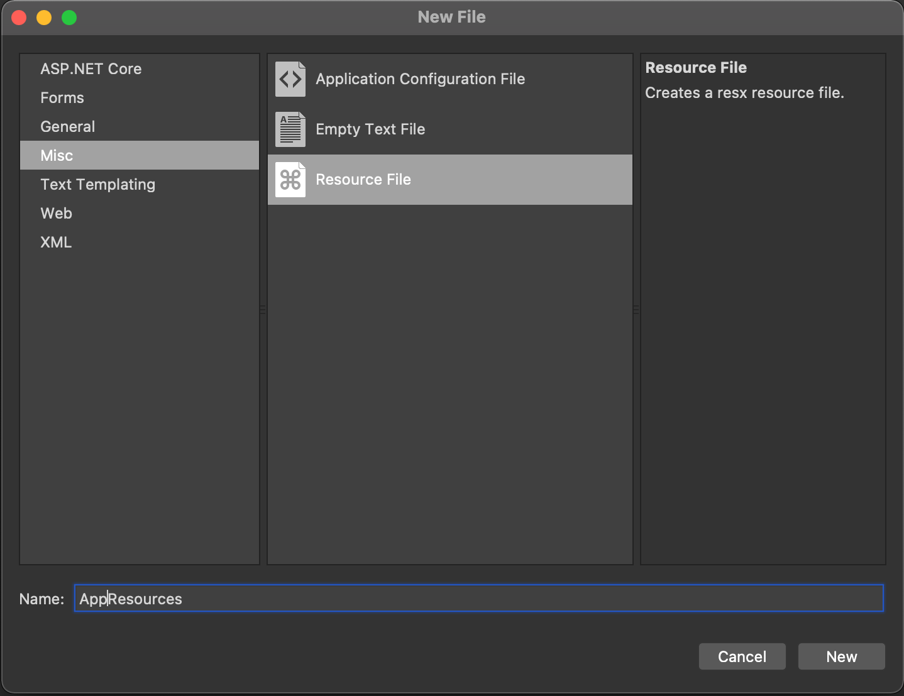
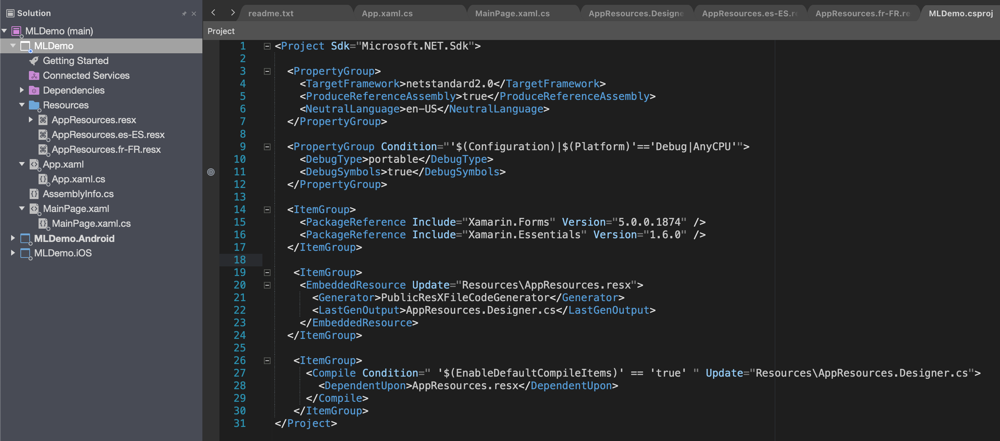

## Adding multilingual support to Xamarin
In this article I will show you how to add multilingual support to a Xamarin forms project. We will use standard Resources files to handle the different languages and in part 2 I will show you how to use the [Multilingual Extension](https://github.com/JoacimWall/Visual-studio-multilingual-extension) for simplify the synchronization from the master file to different language files. 

[Source code of Demo](https://github.com/JoacimWall/Blog_Samples/tree/main/Add%20multilingual%20support%20to%20Xamarin)

### Lets get started
Screenshots in this article is from Visual Studio For Mac but the process is the same for the Windows version of Visual Studio.  Create a Xamarin project by select the template "Blank Forms App"
I will name this app MLDemo and press Next and then create in the next dialog.

Now lets create a new folder named Resources then right click and add a new Resources file to that folder named AppResources and press new.

Now you should have project structure and a AppResources.resx file looking like this on Mac. On Windows the default viewer for resource files that will show you just three columns like Excel. If you right click the file and select view in Xaml editor in Windows you will see the raw content of the file. This resx file is you master language file and it's from this file we will synchronize the translations to the other languages files files. If you created the resx file on Windows computer you will also se the xsd part of the file this is the rolls for the resx file like that you are not allowed to add two data filed with the same name. On mac you will not get this validations. 

Set the natural language of you app by right click the shared project and select options. Then under MetaData/details select English or other preferred language that reflect you master file. In this demo I select English (United States).   

To support two more language lets add two more resx files. In this sample we are going to support French and Spanish. When we add this files we will use a naming convention that include both the country code and language. This is needed if you should support both French in France(Resources.fr-FR.resx) and French in Canada (Resources.fr-CA.resx).  

Now we are going to add two files to the folder Resources
AppResources.fr-FR.resx for French
AppResources.es-ES.resx for Spanish

Important is that we keep the same name as the master resx file in this case AppResources.resx.
For a list of culture codes see [language codes](https://github.com/JoacimWall/Visual-studio-multilingual-extension).

For the intellisense to work the master file needs a AppResources.Designer.cs file. Under property's change Custom Tool to PublicResxFileCodeGenerator. I like to remove the Designer.cs file for the other language files to keep it cleaner as you see in the MLDemo.csproj file.  

## Now lets add some translations
In the master file (AppResources.resx) we add the data block. Where the "name" attribute is what we are going to use when i reference it in code.
In the value tag we write the sentence on Windows we just add the values to the columns.
We do the same for the French and Spanish file but we replace the text in the value filed with translated text in French and Spanish.      

To use the translation in c# files or from you xaml files you just build one time and the AppResources.Designer.cs will be created.  

To get the translation in C# you just use this statement.  

var translation = MLDemo.Resources.AppResources.C_Sharp_Is_Love; 
    
And from xaml 

You add the namespace and then bind the text in the label.  

## Select preferred language
If you like the user to be able to select language that are not the language that are set on the device you can set it by using this lines.  
In the MLDemo App.xaml.cs I have added this lines to hard set the translation to French 
Thread.CurrentThread.CurrentUICulture = new CultureInfo("fr-FR");  
Thread.CurrentThread.CurrentCulture = Thread.CurrentThread.CurrentUICulture;  
MLDemo.Resources.AppResources.Culture = Thread.CurrentThread.CurrentUICulture;

if the users device language is not in the list of translations then the app will use the master files translations.

In the next Article i will show how to simplify management of synchronize and auto translation with Google or Microsoft services using [Multilingual Extension](https://github.com/JoacimWall/Visual-studio-multilingual-extension).  

Thanks Joacim Wall  

If you have questions or comment please add them as Issues on my 
[Blog_Samples Repository](https://github.com/JoacimWall/Blog_Samples/issues)     

[Source code of Demo](https://github.com/JoacimWall/Blog_Samples/tree/main/Add%20multilingual%20support%20to%20Xamarin)

